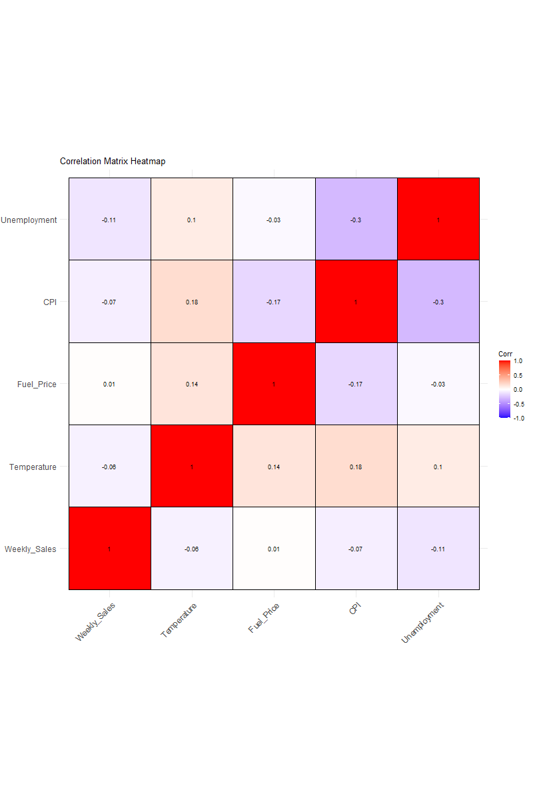

```{r}
# Load necessary libraries
install.packages(c("ggplot2", "reshape2", "ggcorrplot"))
library(ggplot2)
library(reshape2)
library(ggcorrplot)

# Load the dataset
walmart_sales <- read.csv("Walmart_Sales.csv")

# Select only the numeric columns needed for correlation
data_numeric <- walmart_sales[, c("Weekly_Sales", "Temperature", "Fuel_Price", "CPI", "Unemployment")]

# Calculate the correlation matrix
cor_matrix <- cor(data_numeric, use = "complete.obs")  # Use "complete.obs" to handle missing values

# Plot the full correlation heatmap
ggcorrplot(cor_matrix, 
                           method = "square", 
                           type = "full",       # Change to "full" to display the entire matrix
                           lab = TRUE, 
                           lab_size = 3, 
                           title = "Correlation Matrix Heatmap",
                           colors = c("blue", "white", "red"),
                           outline.color = "black",
                           ggtheme = theme_minimal())


```


