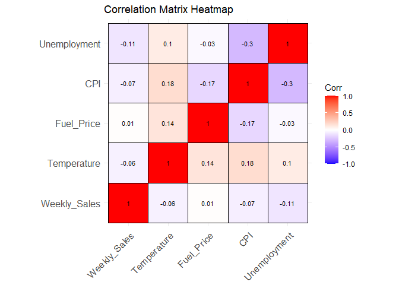
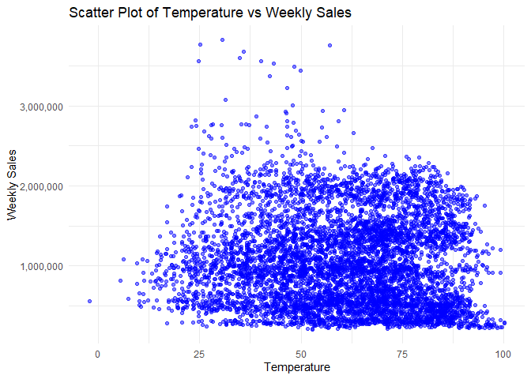
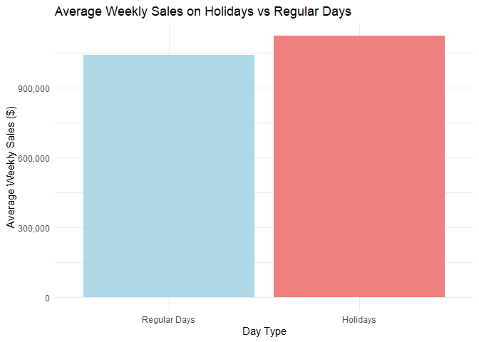
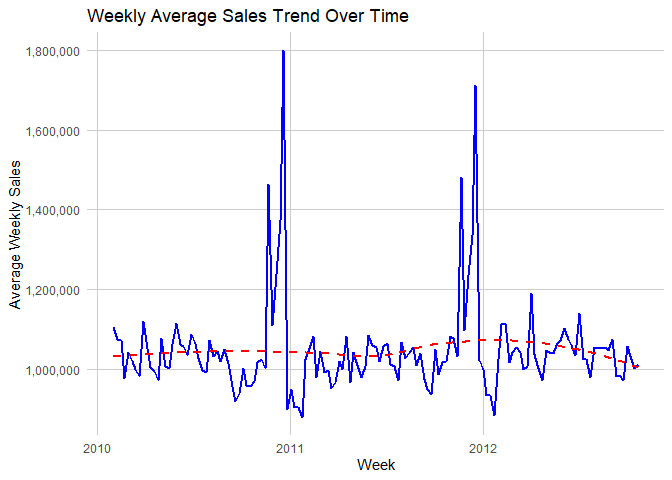
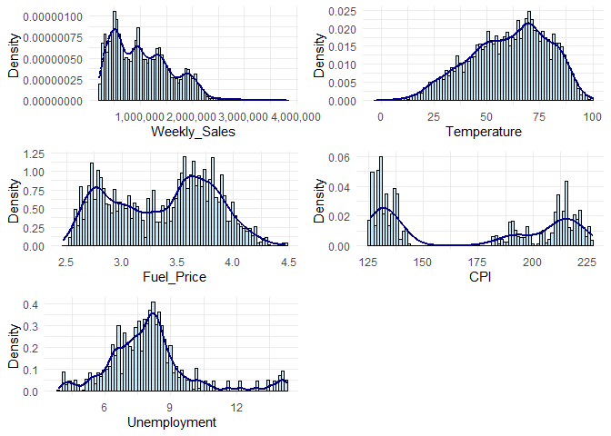

Walmart Sales Analysis
================

## Data Analysis

This analysis explores weekly sales data for Walmart to uncover trends
and correlations among key variables that could impact sales. The
dataset contains weekly sales figures, along with other economic and
environmental factors such as Temperature, Fuel Price, CPI (Consumer
Price Index), and Unemployment. By examining these relationships, we aim
to understand how external factors might influence weekly sales
performance.

The primary objectives of this analysis are :

1.  Correlation Analysis: To evaluate the strength and direction of
    relationships between weekly sales and other variables like
    Temperature, Fuel Price, CPI, and Unemployment.

2.  Holiday Impact Assessment: To assess the effect of holiday periods
    on weekly sales and compare sales performance during holiday and
    non-holiday weeks.

3.  Sales Trend Analysis: To identify overall patterns in weekly average
    sales over time.

To achieve these objectives, we will employ various data visualization
techniques in R, including line plots for trend analysis, heatmaps for
correlation analysis, and scatter plots to examine specific
relationships. The insights gathered will help reveal factors that could
influence Walmart’s sales, providing a basis for strategic business
decisions.

``` r
# Load necessary libraries
library(ggplot2)
library(reshape2)
library(ggcorrplot)

# Load the dataset
walmart_sales <- read.csv("Walmart_Sales.csv")

# Select only the columns needed for correlation
data_numeric <- walmart_sales[, c("Weekly_Sales", "Temperature", "Fuel_Price", "CPI", "Unemployment")]

# Calculate the correlation matrix
cor_matrix <- cor(data_numeric) 

# Plot the full correlation heatmap
ggcorrplot(cor_matrix, 
            method = "square", 
            type = "full",    
            lab = TRUE, 
            lab_size = 3, 
            title = "Correlation Matrix Heatmap",
            colors = c("blue", "white", "red"),
            outline.color = "black",
            ggtheme = theme_minimal())
```

<!-- -->

## Conclusion

1.  **Weekly Sales**

- There is a weak negative correlation between Weekly_Sales and
  Unemployment (-0.11), CPI (-0.07) and Temperature (-0.06). These
  negative values suggest that as unemployment, CPI or temperature
  increases, weekly sales may slightly decrease, though the correlation
  is very weak.

- Weekly Sales show a very weak, almost negligible, positive correlation
  with Fuel Price(0.01)

2.  **Temperature**

- Temperature has a weak positive correlation with CPI (0.18) and
  Fuel_Price (0.14), indicating that temperature might slightly rise
  with the consumer price index and fuel price.

3.  **Fuel Price**

- Fuel_Price has a weak negative correlation with CPI (-0.17), meaning
  that as fuel prices increase, there may be a slight decrease in the
  CPI, though this relationship is weak.

4.  **CPI**

- Moderate negative correlation with Unemployment (-0.3), which shows a
  slight tendency for unemployment to rise as CPI decreases, though this
  is still a weak relationship.

5.  **Unemployment**

- Moderate negative correlation with CPI (-0.3), indicating that when
  unemployment is high, CPI tends to be lower, which could reflect
  general economic trends.

``` r
# Load necessary libraries
library(ggplot2)
library(scales)  # For comma formatting

# Load the dataset
walmart_sales <- read.csv("Walmart_Sales.csv")  # Replace with the correct file path if needed

# Create a scatter plot for Temperature and Weekly Sales with full y-axis values
ggplot(walmart_sales, aes(x = Temperature, y = Weekly_Sales)) +
    geom_point(color = "blue", alpha = 0.5) +  # Scatter points with some transparency
    labs(title = "Scatter Plot of Temperature vs Weekly Sales",
         x = "Temperature",
         y = "Weekly Sales") +
    scale_y_continuous(labels = comma) +  # Format y-axis with full values and commas
    theme_minimal()
```

<!-- -->

## Conclusion

1.  There appears to be weak correlation between temperature and weekly
    sales, as the data points are widely scattered without a clear
    upward or downward trend.

2.  Sales remain relatively consistent across different temperature
    ranges, which shows temperature has minimal impact on weekly sales
    in this dataset.

``` r
# Load necessary libraries
library(ggplot2)
library(dplyr)
library(scales)  

# Load the dataset
walmart_sales <- read.csv("Walmart_Sales.csv")

# Calculate average sales for holidays and regular days
average_sales <- walmart_sales %>%
    group_by(Holiday_Flag) %>%
    summarize(avg_sales = mean(Weekly_Sales))

# Convert Holiday_Flag to a factor for labeling
average_sales$Holiday_Flag <- factor(average_sales$Holiday_Flag, levels = c(0, 1), labels = c("Regular Days", "Holidays"))

# Plotting the average sales with formatted y-axis labels
ggplot(average_sales, aes(x = Holiday_Flag, y = avg_sales, fill = Holiday_Flag)) +
    geom_bar(stat = "identity", show.legend = FALSE) +
    labs(title = "Average Weekly Sales on Holidays vs Regular Days",
         x = "Day Type",
         y = "Average Weekly Sales ($)") +
    scale_y_continuous(labels = comma) +  # Format y-axis labels
    scale_fill_manual(values = c("lightblue", "lightcoral")) +
    theme_minimal()
```

<!-- -->

## Conclusion

1.  **Higher Average Sales on Holidays**

- The bar representing holidays shows a significantly higher average
  weekly sales value compared to regular days. This suggests that
  holidays have a positive impact on weekly sales, likely due to
  increased shopping and spending during holiday periods.

2.  **Regular Days Have Lower Sales Consistency**

- The average weekly sales on regular days are lower, which is expected
  as these periods lack the holiday-specific incentives that drive
  consumers to make larger purchases.

``` r
# Load necessary libraries
library(ggplot2)
library(dplyr)
library(lubridate)  # Load lubridate for date functions
library(scales)     # For comma formatting of y-axis

# Convert Date column to date format
walmart_sales$Date <- dmy(walmart_sales$Date)  # Adjust if Date is in a different format

# Calculate average weekly sales
weekly_avg_sales <- walmart_sales %>%
    mutate(Week = floor_date(Date, "week")) %>%  # Round down to the start of each week
    group_by(Week) %>%
    summarize(avg_weekly_sales = mean(Weekly_Sales, na.rm = TRUE))  # Calculate the average sales per week

# Plot the weekly average sales trend
ggplot(weekly_avg_sales, aes(x = Week, y = avg_weekly_sales)) +
    geom_line(color = "blue", size = 1) +
    geom_smooth(method = "loess", color = "red", linetype = "dashed", se = FALSE) +
    labs(title = "Weekly Average Sales Trend Over Time",
         x = "Week",
         y = "Average Weekly Sales") +
    scale_y_continuous(labels = comma) +
    theme_minimal() +
    theme(
        panel.grid.major = element_line(color = "gray80"),
        panel.grid.minor = element_blank()
    )
```

<!-- -->

## Conclusion

1.  **Significant Sales Peaks**

- There are two notable spikes in weekly average sales, one in late 2010
  and another in late 2011.

2.  **General Stability with Minor Fluctuations**

- Apart from the occasional peaks and dips, weekly average sales remain
  relatively stable around the mean which is the red dashed line.

``` r
library(ggplot2)
library(gridExtra)
# Load necessary libraries
library(ggplot2)
library(gridExtra)
library(scales)  

# Define the columns to plot
columns <- c("Weekly_Sales", "Temperature", "Fuel_Price", "CPI", "Unemployment")

# Calculate the number of bins using the square root rule
num_bins <- round(sqrt(nrow(walmart_sales)))

# Create individual plots for each column with updated syntax
plots <- lapply(columns, function(col) {
    ggplot(walmart_sales, aes(x = .data[[col]])) +
        geom_histogram(aes(y = after_stat(density)), bins = num_bins, fill = "skyblue", color = "black", alpha = 0.5) +
        geom_density(color = "darkblue", linewidth = 1) +
        labs(x = col, y = "Density") +
        scale_x_continuous(labels = comma) +  # Format x-axis with full values and commas
        scale_y_continuous(labels = comma) +  # Format y-axis with full values and commas
        theme_minimal()
})

# Arrange the plots in a grid layout (3 rows, 2 columns)
grid.arrange(grobs = plots, ncol = 2)
```

<!-- -->

## Conclusion

1.  **Weekly Sales**

- Right-skewed, indicating that most weeks have lower sales with
  occasional high sales outliers.

2.  **Temperature**

- Normal distribution, with temperatures clustering around a mean and
  fewer values at extreme lows and highs.

3.  **Fuel Price**

- Likely multimodal, with peaks at certain price ranges, suggesting
  clusters of common fuel prices.

4.  **CPI**

- Close to a bimodal distribution, reflecting different economic
  conditions over time.

5.  **Unemployment**

- Approximately normal distribution, with values clustering around a
  mean and fewer observations at extremely low or high unemployment
  rates.
